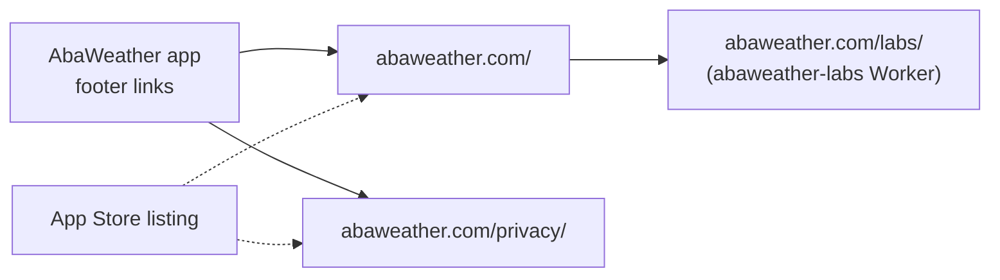

# AbaWeather site documentation

The public support and privacy site at `https://abaweather.com`. Plain HTML
and CSS: no build step, no JavaScript, no analytics, no cookies.

The app links here from its dashboard footer (`/` and `/privacy/`), and the
App Store listing's support and privacy URLs should point here too.

## Where this fits

## Files

| Path | Served at | Contents |
| --- | --- | --- |
| `index.html` | `/` | Support page: what the app is, support email, features, data sources, privacy summary, safety notice |
| `privacy/index.html` | `/privacy/` | Privacy policy (effective date at the top) |
| `styles.css` | `/styles.css` | Shared styles for both pages |
| `CNAME` | — | `abaweather.com`: the custom domain for the static host |
| `README.md` | — | One-paragraph summary |

Both pages share the same header, footer (Home · Labs · Privacy Policy) and
the stylesheet, loaded as `styles.css?v=20260924-2`.

## Hosting

The site is hosted on **GitHub Pages**, published from `main`, with the
custom domain set by the `CNAME` file. The Pages settings themselves live in
the repository's GitHub settings (Settings → Pages), not in a file here.

`/labs/` is not part of this repository. It is served by the
`abaweather-labs` Worker through a Cloudflare route on `abaweather.com`.

## Changing the site

1. Branch from `main`, edit the HTML or CSS.
2. Open the files locally in a browser to check them (no build needed).
3. If you changed `styles.css`, bump the `?v=` value in **both** pages so
   browsers don't keep the old stylesheet.
4. Open a pull request; merging to `main` publishes.

## Changing the privacy policy

The policy is a legal document, so treat each change as deliberate:

1. Decide the change against the app's
   [`docs/data-inventory.md`](https://github.com/kx5don/AbaWeather/blob/main/docs/data-inventory.md),
   which lists every party that receives user data and what they get.
2. Edit `privacy/index.html` and update the **Effective** date.
3. Publish it **before** the app build that changes the data practice ships.
4. Keep the App Store privacy label and the app's `PrivacyInfo.xcprivacy` in
   step.
5. If the change materially affects what users agreed to, decide whether
   users need notice (the policy's section 6 commits to this where the law
   requires it).

## Content that must stay true

| Statement | Where | Depends on |
| --- | --- | --- |
| Support email `support@abaweather.com` | Both pages | The mailbox working |
| Feature list | `index.html` | The app's current features |
| Provider list | `privacy/index.html` §3 | Backend and app integrations |
| "Does not provide raw GPS coordinates to the AI service" | `privacy/index.html` §1 | AbaCast sends only a location name (backend `src/abacast/snapshot.js`) |
| "Does not use advertising or behavioral tracking" | Both pages | No ad or analytics SDKs in the app |

## Known drift (for Don to decide)

Found on 2026-10-08 while documenting the system. Nothing has been changed
on the pages.

1. The privacy policy lists **OpenAI** as an AbaCast provider; production
   AbaCast now uses only Anthropic and Google.
2. The privacy policy doesn't name **Amazon Web Services**, which receives
   radar requests (and the device's IP address) directly from the app via
   the Unidata NEXRAD bucket.
3. The feature list doesn't mention **satellite imagery**.

The app's data inventory has the full list, including one item about
notification registrations not being deleted when notifications are turned
off.
